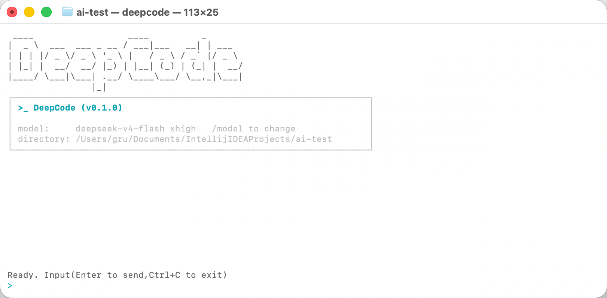
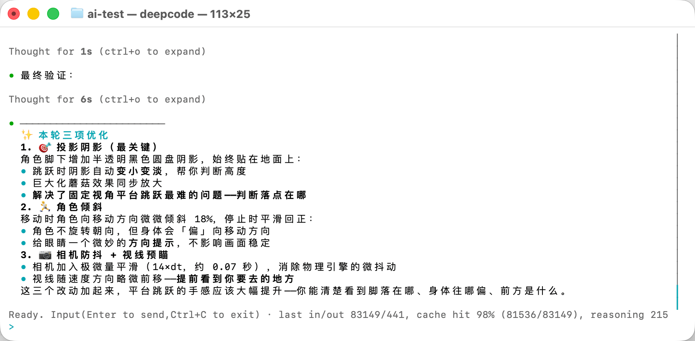

# DeepCode

[简体中文](README.zh-CN.md)

**DeepCode** — a CLI programming agent built in Rust. It supports multiple LLM providers including OpenAI, Anthropic, DeepSeek, Kimi, and Ollama. Through a terminal TUI, it engages in streaming conversations, helps you read and edit files, executes approved shell/git commands constrained by sandbox policies, performs web searches or fetches pages when permitted, and automatically saves sessions for later resumption.

The project was born out of the need for an official programming agent for DeepSeek, which lacked one at the time. It was built entirely from scratch using Vibe Coding. While the core workflow is now functional, many features are still pending and will be added over time. Feel free to fork the project and tailor it into your own coding assistant — let's make it stronger together!

## Screenshots





## Features

- **Provider support**: OpenAI, Anthropic, DeepSeek, Kimi Code, and Ollama.
- **Provider-centric config**: a single configured provider is selected
  automatically; `active_provider` is required only when more than one provider
  is configured.
- **Model catalogs**: DeepCode discovers models from provider APIs, caches the
  catalog, falls back to built-in/configured profiles when discovery is
  unavailable, and exposes `deepcode models` plus `/model refresh`.
- **Interactive TUI**: streaming responses, Markdown rendering, syntax
  highlighting, transcript scrolling, reasoning panel toggling, file-change
  previews, permission prompts, and a session picker.
- **Tool system**: file read/write/edit, shell execution, glob/grep search, web
  fetch/search, git status/diff/log/add/commit/checkout/branch, and subagents.
- **Permissions and sandboxing**: profile-based filesystem, network, shell, and
  tool rules; one-time, session, and persistent approvals; macOS Seatbelt,
  Linux bubblewrap, and Windows restricted-token command sandboxes.
- **Plan-Act mode**: ask DeepCode to produce a plan first, approve or revise it,
  and only then allow mutating work.
- **Session persistence**: UUID-named session files store transcript, workspace,
  provider, model, reasoning effort, and generated titles.
- **Context compression**: provider-specific history compression runs when the
  estimated prompt approaches the active model's context budget.

## Install

### Prerequisites

- [Rust](https://rustup.rs/) with Cargo installed.

### Build

```bash
git clone <repository-url>
cd deepcode
cargo build --release
```

The binary will be available at `target/release/deepcode`.

### Install Into Your PATH

From the project root:

```bash
cargo install --path crates/deepcode-cli
```

Cargo installs the binary as `deepcode`, usually into `~/.cargo/bin`. Make sure
that directory is on your `PATH`:

```bash
export PATH="$HOME/.cargo/bin:$PATH"
```

## Configuration

Copy the example configuration to your config directory:

```bash
mkdir -p ~/.config/deepcode
cp config.example.toml ~/.config/deepcode/config.toml
```

For one provider, only its type, endpoint, and API key are required:

```toml
[providers.deepseek]
type = "deepseek"
api_key = "your-api-key-here"
base_url = "https://api.deepseek.com"
```

With multiple providers, set `active_provider`:

```toml
active_provider = "deepseek"

[providers.deepseek]
type = "deepseek"
api_key = "your-api-key-here"
base_url = "https://api.deepseek.com"

[providers.ollama]
type = "ollama"
base_url = "http://localhost:11434"
```

Supported provider types are `openai`, `anthropic`, `deepseek`, `kimi`, and
`ollama`. The `kimi` provider accepts Kimi Code membership keys, defaults to
`https://api.kimi.com/coding/v1`, and provides `k3`, `k3-256k`,
`kimi-for-coding`, and `kimi-for-coding-highspeed`. Without an explicit model,
the universally available `kimi-for-coding` is selected. Official OpenAI
endpoints default to the Responses API. OpenAI-style
gateways and DeepSeek default to Chat Completions; set `wire_api = "responses"`
or `wire_api = "chat_completions"` inside an OpenAI or DeepSeek provider table
to override that. In the current DeepSeek implementation, Responses API is only
accepted for `deepseek-v4-flash`.

Optional provider fields include:

```toml
[providers.deepseek]
type = "deepseek"
api_key = "your-api-key-here"
base_url = "https://api.deepseek.com"
model = "deepseek-v4-flash"
reasoning_effort = "high"
connect_timeout_secs = 30
read_timeout_secs = 300
max_concurrent_requests = 4
```

`connect_timeout_secs` only limits connection establishment. `read_timeout_secs`
limits how long a response may remain idle and resets after every successful
read; streaming model requests have no total duration limit. The legacy
`request_timeout_secs` name is still accepted as an alias for
`read_timeout_secs`.

Unknown or private models can override the conservative default profile:

```toml
[providers.deepseek.models."private-model"]
display_name = "Private Model"
context_window = 131072
max_output_tokens = 16384
reasoning_efforts = ["off", "low", "high", "xhigh", "max"]
default_reasoning_effort = "high"
```

If `model` is not configured, DeepCode uses the first model in the resolved
catalog. Catalog sorting prefers known built-in model profiles when they are
present. If `reasoning_effort` is not configured, DeepCode chooses a
provider/model default and falls back to the first effort declared by the model.
`/effort` only accepts values supported by the active model.

Hosted model catalogs are fresh for 24 hours; Ollama catalogs are fresh for 5
minutes. Soft-stale catalogs are used immediately and refreshed in the
background. Catalogs older than 7 days try a synchronous refresh but remain
usable on transient failures when cached data exists. Catalog cache files live
under `DEEPCODE_DATA_DIR/model-catalogs` or
`~/.local/share/deepcode/model-catalogs`; API keys are not written to those
files.

Inspect or refresh the active provider catalog:

```bash
deepcode models
deepcode models --refresh
```

### Tool And Permission Settings

`default_permissions` defaults to the built-in `:workspace` profile when
omitted. The example config defines a named `project-edit` profile:

```toml
default_permissions = "project-edit"

[tools]
disabled = []
max_file_size_bytes = 1048576

[permissions]
# policy_files = ["~/.config/deepcode/policies/default.star"]
# write_policy_file = "~/.config/deepcode/policies/user.star"

[permissions.project-edit]
description = "Workspace editing with explicit network and sensitive-file boundaries."
extends = ":workspace"

[permissions.project-edit.filesystem.":workspace_roots"]
"." = "write"
"**/.env*" = "deny"
"Cargo.toml" = { write = "prompt" }
"package.json" = { write = "prompt" }

[permissions.project-edit.filesystem]
"~/.ssh/**" = "deny"
"~/.aws/**" = "deny"
"/etc/**" = "deny"

[permissions.project-edit.network]
enabled = true
default = "prompt"

[permissions.project-edit.network.domains]
"github.com" = "allow"
"*.githubusercontent.com" = "allow"
"169.254.169.254" = "deny"

[[permissions.project-edit.shell.rules]]
pattern = ["git", ["status", "diff", "log"]]
decision = "allow"

[[permissions.project-edit.shell.rules]]
pattern = ["git", "push"]
decision = "deny"

[[permissions.project-edit.tool.rules]]
tool = "git_checkout"
action = "restore_files"
decision = "prompt"
justification = "Restoring files can overwrite local work."
```

- `disabled` skips matching built-in tools when the registry is created.
- `max_file_size_bytes` applies to `read_file`, `write_file`, and `edit_file`.
- Permission profiles combine filesystem, network, shell, and tool rules into
  `allow`, `prompt`, and `deny` decisions.
- Interactive approvals can be granted once, for the session, or persistently.
  Persistent grants are stored in `~/.config/deepcode/policies/permissions.toml`
  by default.
- `write_file` and `edit_file` prepare a unified diff preview before applying a
  change unless policy has already allowed it.
- Shell and git commands run with the sandbox policy chosen by the permission
  system. Sandbox-required execution fails closed when no supported backend is
  available.
- On Windows, restricted tokens, path-scoped capability SIDs, inherited ACLs,
  and Job Objects enforce filesystem write boundaries and process-tree cleanup.
  Read access still follows the current Windows user, so filesystem read-deny
  rules continue to rely on the tool permission layer. Network blocking in this
  non-administrator backend is advisory (proxy and package-manager overrides),
  so network-capable commands still require normal permission approval.
  `DEEPCODE_SHELL` can override the default PowerShell executable.

## Usage

### Start An Agent In The Current Directory

```bash
cd /path/to/your/project
deepcode
```

Running `deepcode` without a subcommand starts the interactive chat TUI. The
workspace root is the directory where you start the command. File and search
tools are restricted to that workspace root.

The first time DeepCode enters a workspace, it shows the canonical folder path
and asks you to confirm that you trust it before loading a provider, registering
tools, or starting an agent. Trust is remembered per folder identity; deleting
and recreating a folder at the same path requires confirmation again.

Equivalent explicit command:

```bash
deepcode chat
```

List sessions and resume by UUID or the latest session in this workspace:

```bash
deepcode sessions
deepcode sessions --all --limit 50
deepcode resume 550e8400-e29b-41d4-a716-446655440000
deepcode resume --last
```

### One-Shot Execution

```bash
deepcode run "Explain this codebase to me"
```

One-shot mode uses the same workspace trust, provider resolution, tools,
permissions, file-change previews, and session checkpointing as chat mode.

### TUI Slash Commands

| Command | Description |
|---------|-------------|
| `/model` | Show the current model and configured choices |
| `/model <name>` | Switch to another model in the current catalog |
| `/model refresh` | Force-refresh the current provider model catalog |
| `/effort` | Show the current reasoning effort and active model choices |
| `/effort <tier>` | Set an effort supported by the active model |
| `/permissions` | Show a read-only snapshot of the active permission policy |
| `/sessions` | Browse saved sessions for the current workspace |
| `/resume` | Browse saved sessions for the current workspace |
| `/resume <id>` | Resume a saved session directly |
| `/plan` | Enable persistent Plan-Act mode for future tasks |
| `/plan off` | Disable persistent Plan-Act mode |
| `/plan <task>` | Generate a plan for one task and wait for approval |
| `/act` | Disable Plan-Act mode and return to direct execution |
| `/clear` | Save the current session and start a clean session |
| `/help` | Show available commands |
| `/exit` | Exit the session |
| `/quit` | Exit the session |

In Plan-Act mode, DeepCode first produces a step-by-step plan, waits for
approval, and only then executes. During planning, only read-only tools that do
not require approval are exposed.

### TUI Keyboard And Mouse

| Shortcut | Action |
|----------|--------|
| `Ctrl+C` | Exit DeepCode |
| `Esc` | Interrupt current work; reject active prompts |
| `Enter` | Send input or accept the selected prompt action |
| `Left` / `Right` / `Tab` | Change selection in permission, plan, or file preview prompts |
| `Shift+Up` / `Shift+Down` or `Alt+Up` / `Alt+Down` | Scroll transcript |
| `PageUp` / `PageDown` | Scroll transcript by page |
| `Home` / `End` | Move within input; `End` jumps to transcript bottom when input is empty |
| `Ctrl+O` | Expand or collapse the reasoning panel |
| Mouse scroll | Scroll transcript |
| Mouse click | Copy selection to clipboard |

Session picker keys: `Up`/`Down` select, `Enter` resumes, `a` toggles
current-workspace versus all-workspace sessions, and `Esc` or `q` closes the
picker.

Permission prompts accept `y` once, `s` for the session, `a` always, `n` deny,
and `q` quit. Plan prompts accept `y`/`a` approve, `r` revise, `n` reject, and
`q` quit. File previews accept `y`/`a` apply, `n`/`r` reject, and `q` quit.

## CLI Reference

```bash
deepcode --provider openai --model gpt-4.1 chat
deepcode --provider deepseek --model deepseek-v4-flash chat
deepcode --config /path/to/config.toml run "Hello"
deepcode --log-level debug chat
```

Global flags:

| Flag | Description |
|------|-------------|
| `--config <path>` | Config file path (default: `~/.config/deepcode/config.toml`) |
| `--provider <name>` | Override the configured provider |
| `--model <name>` | Override the configured model |
| `--log-level <level>` | Log level: `trace`, `debug`, `info`, `warn`, `error`, `off` (default: `info`) |

Subcommands:

| Command | Description |
|---------|-------------|
| `deepcode` / `deepcode chat` | Start the interactive TUI |
| `deepcode run <prompt>` | Run a one-shot prompt |
| `deepcode config` | Print the redacted config and catalog status |
| `deepcode models [--refresh]` | List the active provider catalog |
| `deepcode sessions [--all] [--limit N]` | List saved sessions |
| `deepcode resume <id>` | Resume a specific session |
| `deepcode resume --last` | Resume the latest current-workspace session |

## Data And Logs

By default, DeepCode stores:

- sessions in `~/.local/share/deepcode/sessions`
- model catalogs in `~/.local/share/deepcode/model-catalogs`
- workspace trust decisions in `~/.local/share/deepcode/trusted_workspaces.json`
- persistent approval grants in `~/.config/deepcode/policies/permissions.toml`
- logs in `~/.local/state/deepcode/logs/deepcode.log`

Overrides:

```bash
DEEPCODE_DATA_DIR=/tmp/deepcode-data deepcode run "hello"
DEEPCODE_LOG_FILE=/tmp/deepcode.log deepcode chat
DEEPCODE_STATE_DIR=/tmp/deepcode-state deepcode chat
```

## Built-In Tools

| Tool | Description | Safety |
|------|-------------|--------|
| `read_file` | Read file contents with optional offset/limit | Read-only |
| `write_file` | Write or overwrite files with preview support | Safe mutation |
| `edit_file` | Replace or insert part of an existing file with preview support | Safe mutation |
| `shell` | Execute shell commands through shell permissions | Destructive |
| `glob` | File pattern matching | Read-only |
| `grep` | Text search in files | Read-only |
| `web_fetch` | Fetch HTTP(S) content as text | Network |
| `web_search` | Search DuckDuckGo HTML results | Network |
| `git_status` | Show git working tree status | Read-only |
| `git_diff` | Show git diff | Read-only |
| `git_log` | Show git commit history | Read-only |
| `git_add` | Stage files for commit | Safe mutation |
| `git_commit` | Create a git commit | Safe mutation |
| `git_checkout` | Checkout branches or restore files | Destructive |
| `git_branch` | List, create, or delete branches | Safe mutation |
| `agent` | Spawn a subagent with a fresh conversation context | Safe mutation |

File and search tools are restricted to the workspace directory where
`deepcode` is started. Shell commands run from a workspace-validated working
directory, respect the configured shell permission policy, time out after 60
seconds, and truncate very large output.

## Project Structure

```text
crates/
├── deepcode-core/        # Core types, configuration, errors, provider traits
├── deepcode-providers/   # LLM provider implementations and model catalogs
├── deepcode-tools/       # Built-in tool registry and implementations
├── deepcode-agent/       # Agent loop, state management, planning, streaming
├── deepcode-permissions/ # Permission policy pipeline and approvals
├── deepcode-sandbox/     # OS sandbox command preparation
└── deepcode-cli/         # CLI entry point, commands, sessions, TUI
```

## Development

```bash
# Compile
cargo check

# Run tests
cargo test --workspace --all-targets

# Run with file logging
cargo run -- --log-level debug --config config.example.toml chat

# Check formatting
cargo fmt --all -- --check

# Run clippy
cargo clippy --workspace --all-targets -- -D warnings
```

The CI workflow runs formatting, clippy, and tests on Ubuntu, macOS, and
Windows. Linux CI installs `bubblewrap` before testing sandboxed command
execution.

## License

DeepCode is licensed under the [MIT License](LICENSE). See
[THIRD_PARTY_NOTICES.md](THIRD_PARTY_NOTICES.md) for referenced upstream work.
